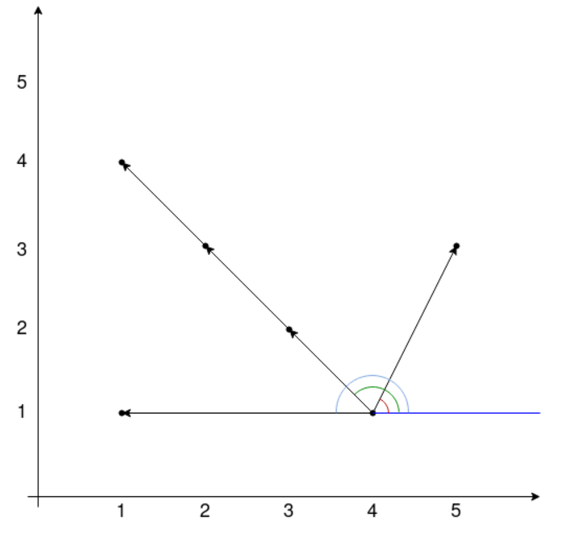

Идея решения за квадрат заключается в том, чтобы пробежаться по всем точкам, и, фиксируя каждую, для каждой создавать HashMap, ключом которой будет угол от фиксированной точки до этой, а значением количество точек, у которых угол такой же.

