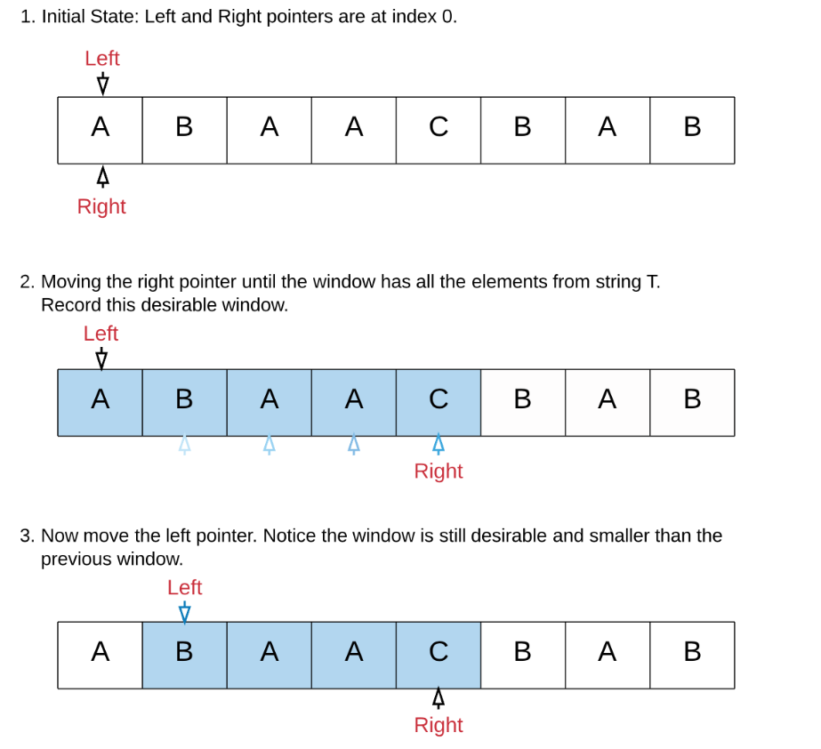
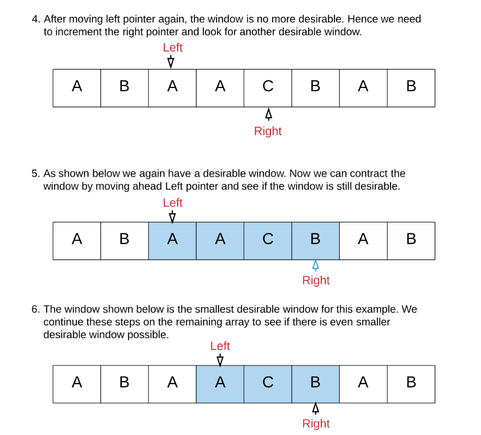

В общем, задача решается через два указателя, изначально они оба находятся на нуле. Затем r двигаем направо пока окно НЕ 
подходит под условие задачи. Как только окно стало подходить под условие задачи, начинаем двигать l, пока окно подходит под условие, 
как только перестанет подходить, то снова всё повторяем. То есть двигаем r, двигаем l и так далее...

Самый важные переменные для меня это:\
int formedCharsInWindow = 0; // how many characters have good frequency (freq c in mapOfT = freq c in mapOfWindow)\
int requiredFormedCharsInWindow = mapOfT.keySet().size();

