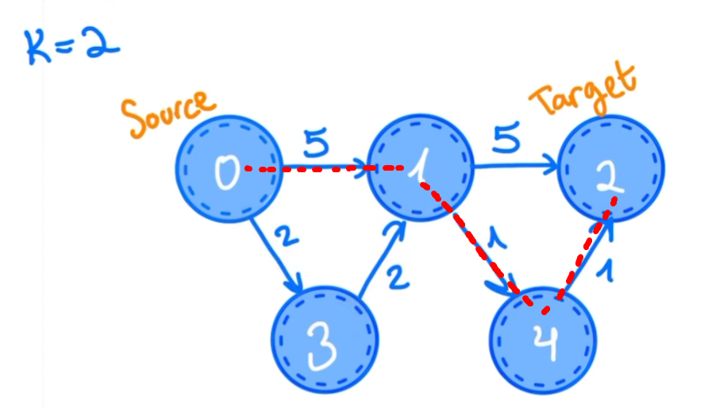

Задачка мерзкая, конечно, но в дальнейшем может быть очень полезна. Голый алгоритм Дейкстры не работает совсем, потому что тут иногда выгоднее пойти сначала по невыгодному пути, который в дальнейшем окупится, например, вот:

Дейкстра бы тут сказала, что лучший путь до единицы - это 4, через две двойки, но нам выгоднее сначала пойти по длинному пути (5), а затем по двум единичкам.

В общем, какая идея:
Заводим приоритетную очередь вершин, в которой все будет отсортировано по расстоянию от src.
Таким образом, всегда будем брать текущий наикратчайший путь, что очень важно.
В приоритетной очереди будем хранить информацию в виде: <code>{distance_from_src, cur_node, stops_from_src}</code>
То есть всегда будем знать расстояние от src до curNode, саму curNode и количество шагов от src до curNode.
Для оптимизации не будет рассматривать записи в PriorityQueue, которые для конкретной ноды длиннее И имеют больше шагов, так как они априори хуже.
