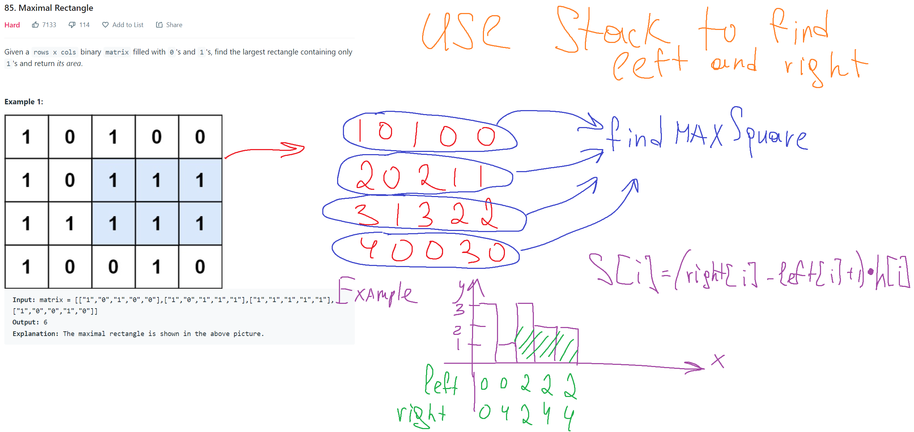
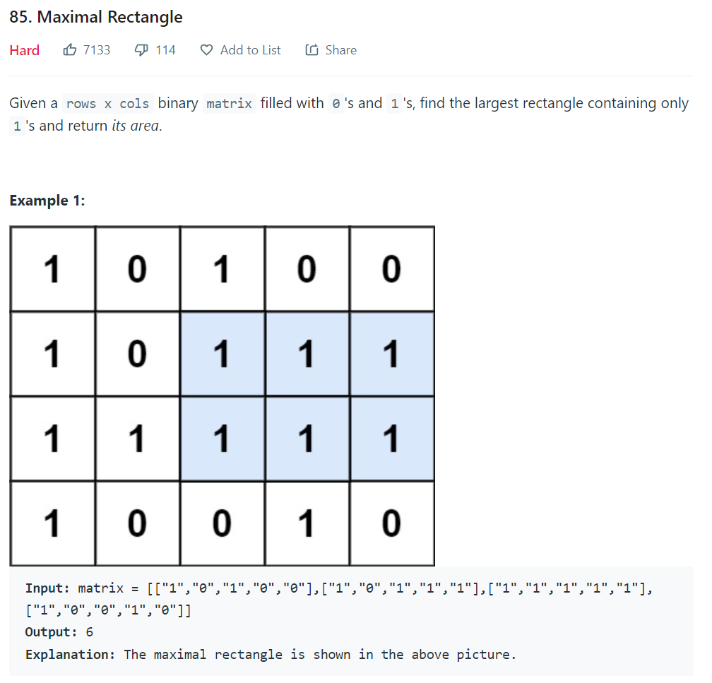

https://www.youtube.com/watch?v=vcv3REtIvEo

Ключевая идея в использовании стека для быстрого поиска левого индекса и правого индекса, в диапазоне которых наш i-ый столбик полностью влезает, то есть образует прямоугольник
