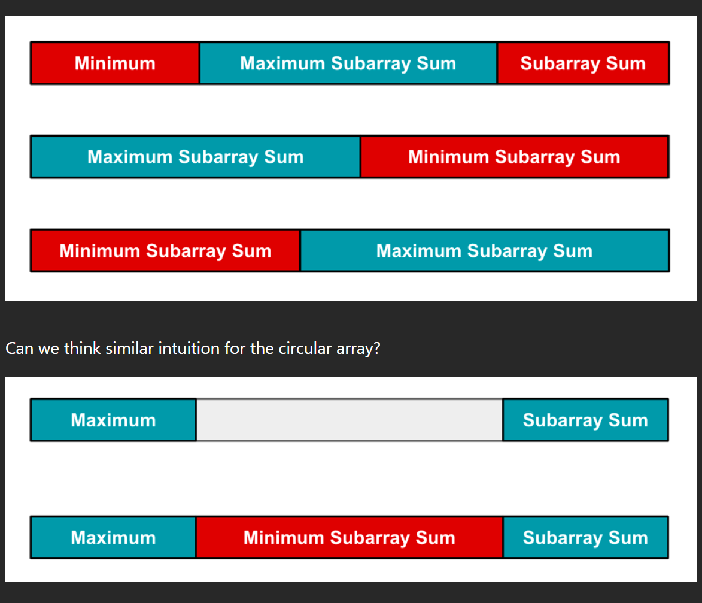

Очень интересная и сложная задача, если не знать про алгоритм Kadane.
Сам алгоритм очень хорошо описан [здесь](https://e-maxx.ru/algo/maximum_average_segment)
Также нужно додуматься, что циркулярный массив может быть чётко разбит на два подмассива, один будет являться минимальным подмассивом, второй будет являться максимальным подмассивом.
Также array = subArray_max + subArray_min (под плюсом имею в виду конкатенацию массивов).

И надо прийти к выводу, что на части может быть разбит либо минимальный подмассив, либо максимальный. То есть кто-то из них один обязательно ПОЛНОСТЬЮ окажется внутри массива и его не разорвет на части. 

Поэтому наша задача найти subArray_max в обычном массиве с помощью алгоритма Кадане и также найти subArray_min

Максимум из subArray_max и totalSum - subArray_min будет являться нашим ответом (totalSum - subArray_min соответствует ситуации, когда наш подмассив с максимальной суммой разорвало на части и мы его находим через минимальный и общую сумму).

### Алгоритм Кадане

Позволяет найти подмассив массива с максимальной суммой. 

Следим за частичной суммой, итерируясь последовательно по элементам. Если вдруг она оказывается отрицательной, то обнуляем ее, так как теперь эту часть не имеет смысла брать в искомый подмассив.
Максимум из всех таких частичных сумм и будет являться ответом.

Картинка с форума для лучшего понимания разрывания подмассивов:
